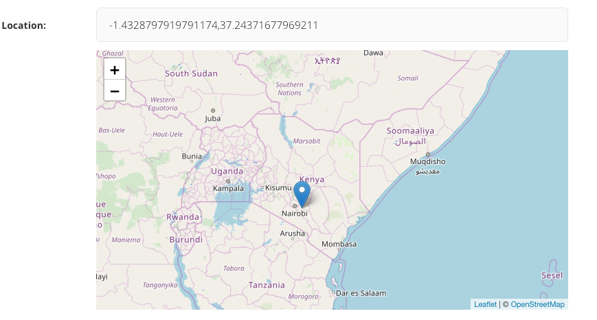

# Wagtail-Leaflet-Widget

This is a [Leaflet JS](https://leafletjs.com) based wagtail panel for picking geo location on a map, inspired by [wagtail-geo-widget](https://github.com/Frojd/wagtail-geo-widget)

## Features

- Real spatial support (with GeoDjango and PointField)
- Storing coordinates as strings (for no-GeoDjango setups)
- StreamField integration
- Inline panel support

## Documentation

- [Getting started](./docs/getting-started.md)
- [Settings](./docs/settings.md)
- [Adding the widget to a Page](./docs/adding-to-a-page.md)
- [Integrating with GeoDjango](./docs/integrating-with-geodjango.md)
- [Adding to a StreamField](./docs/adding-to-a-streamfield.md)
- [FAQ](./docs/faq.md)

## Contributing

Want to contribute? Awesome. Just send a pull request.

## License

Wagtail-Leaflet-Widget is released under the [MIT License](http://www.opensource.org/licenses/MIT).